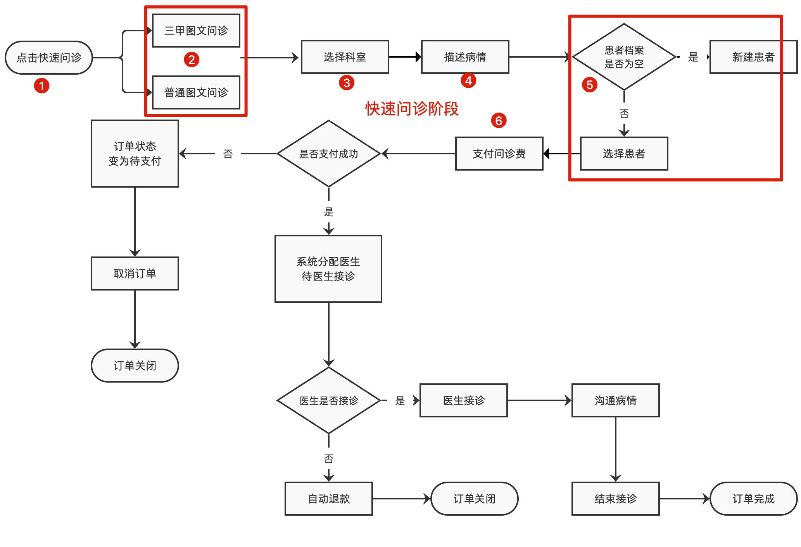
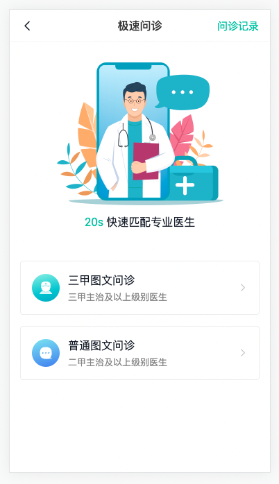
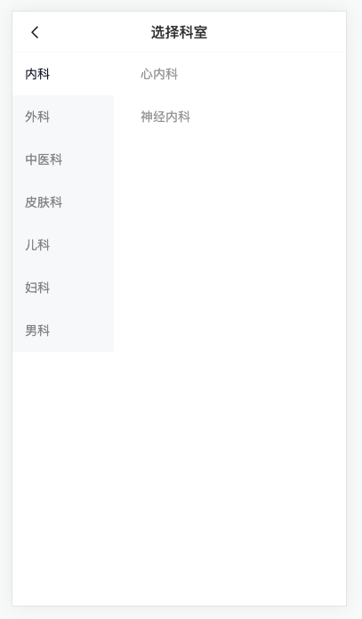
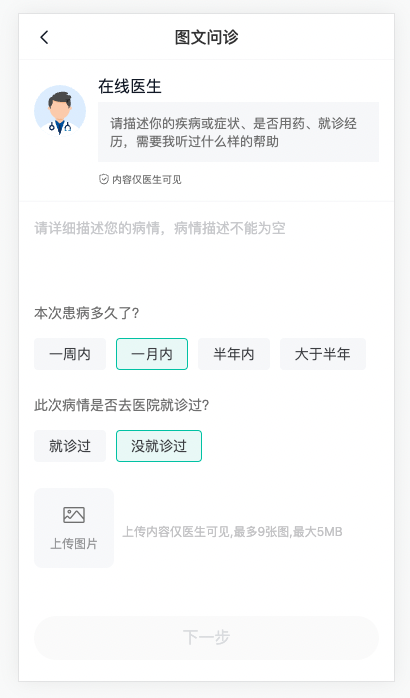
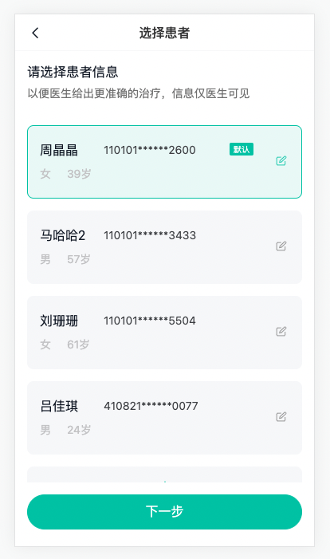
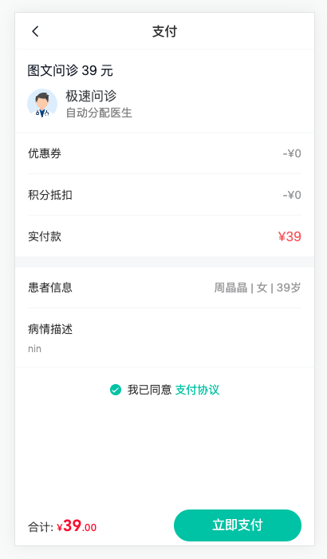
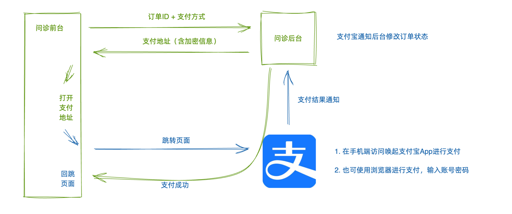
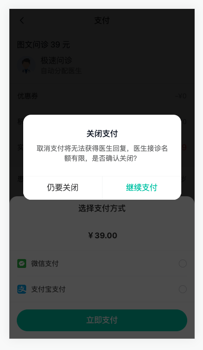

# 极速问诊模块

## 极速问诊-需求分析{#consult-product}
> 理解：极速问诊阶段流程分析



极速问诊阶段：

1. 极速问诊（记录-问诊类型）

2. 三甲图文问诊 或 普通图文问诊（记录-极速问诊类型）

3. 选择科室（记录-疾病科室）

4. 描述病情（记录-症状详情、时间、是否就诊过、图片）

5. 选择患者（记录-患者ID）

6. 支付问诊费

所有流程走完才能组合成完整的问诊记录，而且是不同的页面采集数据，这个实现需要 `pinia` 

还有一个发现：接口数据

- type 就诊类型：  1找医生   2极速问诊   3开药问诊  `type:1|2|3`
- illnessType 极速问诊类型：0普通  1三甲	`illnessType: 0|1`

提问：

- 刚刚看到 1 2 3 的时候你能记得他们代表什么意思吗？
  - 不清楚，对于数字字面量类型的联合类型语义差，建议使用 `枚举`


## 枚举基本语法{#enum-base}

> 掌握：枚举的基本语法和使用细节

- 作用：表示一组明确可选的值，和字面量类型配合联合类型类似。
- 解释：枚举可以定义一组常量，使用该类型后，约定只能使用这组常量中的其中一个。

```ts
// 创建枚举类型
enum Direction { Up, Down, Left, Right }

// 使用枚举类型
const changeDirection = (direction: Direction) => {
  console.log(direction)
}

// 调用函数时，需要应该传入：枚举 Direction 成员的任意一个
// 类似于 JS 中的对象，直接通过 点（.）语法 访问枚举的成员
changeDirection(Direction.Up)
```

问题：
- 通过枚举访问其成员，成员的值是什么？
  - 默认从 0 开始自增的数值
- 可以修改其成员的值吗？
  - `Up = 10` , 后面是从 10 开始自增
- 成员的值可以使用字符串吗？
  - `Up = 'Up'` 可以，但是后面的值都需要使用字符串。
- 如果这组可选值语义很高，如 ` topic | knowledge | doc | disease ` ，使用字面量配合联合类型更简单些
- 为什么建议 ts 文件定义枚举
  - 枚举的值经常需要在运行的时候使用，`d.ts` 不参与运行。


## 极速问诊-定义类型{#consult-type}
> 定义问诊记录数据相关类型

步骤：
- 问诊类型枚举
- 问诊时间枚举
- 图片数组类型
- 问诊记录类型

代码：

`enums/index.ts`
```ts
// 问诊类型
export enum ConsultType {
  /** 找医生 */
  Doctor = 1,
  /** 快速问诊 */
  Fast = 2,
  /** 开药问诊 */
  Medication = 3
}
// 问诊时间，以1自增可以省略
export enum IllnessTime {
  /** 一周内 */
  Week = 1,
  /** 一月内 */
  Month,
  /** 半年内 */
  HalfYear,
  /** 半年以上 */
  More
}
```

`types/consult.d.ts`
```ts
import { ConsultType, IllnessTime } from '@/enums'

// 图片列表
export type Image = {
  /** 图片ID */
  id: string
  /** 图片地址 */
  url: string
}
// 问诊记录
export type Consult = {
  /** 问诊记录ID */
  id: string
  /** 问诊类型 */
  type: ConsultType
  /** 快速问诊类型，0 普通 1 三甲 */
  illnessType: 0 | 1
  /** 科室ID */
  depId: string
  /** 疾病描述 */
  illnessDesc: string
  /** 疾病持续时间 */
  illnessTime: IllnessTime
  /** 是否就诊过，0 未就诊过  1 就诊过 */
  consultFlag: 0 | 1
  /** 图片数组 */
  pictures: Image[]
  /** 患者ID */
  patientId: string
  /** 优惠券ID */
  couponId: string
}

// 问诊记录-全部可选
export type PartialConsult = Partial<Consult>
// Required 转换为全部必须   Partial 转换问全部可选  两个内置的泛型类型
```
小结：
- 全部可选是因为信息是一点一点累加上去的
- Required 转换为全部必须
- Partial 转换问全部可选 

注意：
- 枚举类型需要在 ts 文件中，因为枚举会编译成 js 代码

## 极速问诊-问诊记录仓库{#consult-store}
> 实现：病情描述仓库的定义，实现问诊记录分步修改

步骤：
- 定义仓库，提供
  - 问诊记录状态
  - 修改问诊类型
  - 修改极速问诊类型
  - 修改科室
  - 修改病情描述相关信息
  - 修改患者
  - 清空记录
- 导出仓库
- 首页点击极速问诊记录问诊类型且跳转页面

代码：

1）定义仓库 `stores/modules/consult.ts`

```ts
import type { ConsultType } from '@/enums'
import type { PartialConsult } from '@/types/consult'
import { defineStore } from 'pinia'
import { ref } from 'vue'

export const useConsultStore = defineStore(
  'cp-consult',
  () => {
    const consult = ref<PartialConsult>({})
    // 设置问诊类型
    const setType = (type: ConsultType) => (consult.value.type = type)
    // 设置极速问诊类型
    const setIllnessType = (type: 0 | 1) => (consult.value.illnessType = type)
    // 设置科室
    const setDep = (id: string) => (consult.value.depId = id)
    // 设置病情描述
    const setIllness = (
      illness: Pick<PartialConsult, 'illnessDesc' | 'illnessTime' | 'consultFlag' | 'pictures'>
    ) => {
      consult.value.illnessDesc = illness.illnessDesc
      consult.value.illnessTime = illness.illnessTime
      consult.value.consultFlag = illness.consultFlag
      consult.value.pictures = illness.pictures
    }
    // 设置患者
    const setPatient = (id: string) => (consult.value.patientId = id)
    // 设置优惠券
    const setCoupon = (id?: string) => (consult.value.couponId = id)
    // 清空记录
    const clear = () => (consult.value = {})
    return { consult, setType, setIllnessType, setDep, setIllness, setPatient, setCoupon, clear }
  },
  {
    persist: true
  }
)
```

2) 导出仓库 `stores/index.ts`

```ts
export * from './modules/consult'
```

3）首页点击极速问诊记录问诊类型且跳转页面 `views/Home/index.vue`

```ts
import { useConsultStore } from '@/stores'
import { ConsultType } from '@/enums'

const store = useConsultStore()
```

```html
<router-link to="/consult/fast" @click="store.setType(ConsultType.Fast)" class="nav">
```

## 极速问诊-选择极速问诊类型{#consult-change-type}



> 完成选择三甲还是普通问诊页面，点击后记录对应的类型，跳转到选择科室路由

步骤：
- 路由和组件
- 编写页面布局
- 点击入口记录极速问诊类型

代码：

1）路由和组件 

`Consult/ConsultFast.vue`
```vue
<script setup lang="ts"></script>

<template>
  <div class="consult-fast-page">consult</div>
</template>

<style lang="scss" scoped></style>
```
`router/index.ts`
```ts
    {
      path: '/consult/fast',
      component: () => import('@/views/Consult/ConsultFast.vue'),
      meta: { title: '极速问诊' }
    }
```

2）编写页面布局

```vue
<script setup lang="ts"></script>

<template>
  <div class="consult-fast-page">
    <cp-nav-bar title="极速问诊" right-text="问诊记录"></cp-nav-bar>
    <div class="fast-logo">
      
      <p class="text"><span>20s</span> 快速匹配专业医生</p>
    </div>
    <div class="fast-type">
      <router-link to="/consult/dep" class="item">
        <cp-icon class="pic" name="consult-doctor"></cp-icon>
        <div class="info">
          <p>三甲图文问诊</p>
          <p>三甲主治及以上级别医生</p>
        </div>
        <van-icon name="arrow"></van-icon>
      </router-link>
      <router-link to="/consult/dep" class="item">
        <cp-icon class="pic" name="consult-message"></cp-icon>
        <div class="info">
          <p>普通图文问诊</p>
          <p>二甲主治及以上级别医生</p>
        </div>
        <van-icon name="arrow"></van-icon>
      </router-link>
    </div>
  </div>
</template>

<style lang="scss" scoped>
.consult-fast-page {
  padding-top: 46px;
  .fast-logo {
    padding: 30px 0;
    text-align: center;
    .img {
      width: 240px;
    }
    .text {
      font-size: 16px;
      margin-top: 10px;
      > span {
        color: var(--cp-primary);
      }
    }
  }
  .fast-type {
    padding: 15px;
    .item {
      display: flex;
      padding: 16px;
      border-radius: 4px;
      align-items: center;
      margin-bottom: 16px;
      border: 0.5px solid var(--cp-line);
    }
    .pic {
      width: 40px;
      height: 40px;
    }
    .info {
      margin-left: 12px;
      flex: 1;
      > p:first-child {
        font-size: 16px;
        color: var(--cp-text1);
        margin-bottom: 4px;
      }
      > p:last-child {
        font-size: 13px;
        color: var(--cp-tag);
      }
    }
    .van-icon {
      color: var(--cp-tip);
    }
  }
}
</style>
```


3）点击入口记录极速问诊类型

```ts
<script setup lang="ts">
import { useConsultStore } from '@/stores'

const store = useConsultStore()
</script>
```

```html
      <router-link to="/consult/dep" class="item" @click="store.setIllnessType(1)">
```

```html
      <router-link to="/consult/dep" class="item" @click="store.setIllnessType(0)">
```

## 极速问诊-选择科室-布局{#consult-dep-html}



> 实现：路由与组件，和基础结构

步骤：
- 组件与路由
- 页面结构

代码：

1）路由与组件

`Consult/ConsultDep.vue`
```vue
<script setup lang="ts"></script>

<template>
  <div class="consult-dep-page">consult-dep</div>
</template>

<style lang="scss" scoped></style>
```
`router/index.ts`
```ts
    {
      path: '/consult/dep',
      component: () => import('@/views/Consult/ConsultDep.vue'),
      meta: { title: '选择科室' }
    }
```

2) 页面布局
```vue
<script setup lang="ts">
import { ref } from 'vue'

const active = ref(0)
</script>

<template>
  <div class="consult-dep-page">
    <cp-nav-bar title="选择科室" />
    <div class="wrapper">
      <van-sidebar v-model="active">
        <van-sidebar-item title="内科" />
        <van-sidebar-item title="外科" />
        <van-sidebar-item title="皮肤科" />
        <van-sidebar-item title="骨科" />
      </van-sidebar>
      <div class="sub-dep">
        <router-link to="/consult/illness">科室一</router-link>
        <router-link to="/consult/illness">科室二</router-link>
        <router-link to="/consult/illness">科室三</router-link>
      </div>
    </div>
  </div>
</template>

<style lang="scss" scoped>
.van-sidebar {
  width: 114px;
  &-item {
    padding: 14px;
    color: var(--cp-tag);
    &--select {
      color: var(--cp-main);
      font-weight: normal;
      &::before {
        display: none;
      }
    }
  }
}
.consult-dep-page {
  padding-top: 46px;
  .wrapper {
    height: calc(100vh - 46px);
    overflow: hidden;
    display: flex;
    .sub-dep {
      flex: 1;
      height: 100%;
      overflow-y: auto;
      > a {
        display: block;
        padding: 14px 30px;
        color: var(--cp-dark);
      }
    }
  }
}
</style>
```

小结
- 需要实现一级科室的切换要绑定数据

## 极速问诊-选择科室-业务{#consult-dep-logic}
> 实现：科室切换以及跳转到病情描述

步骤：

- 编写科室需要的类型
- 准备API函数
- 实现一级科室切换
- 实现二级科室切换
- 跳转时记录科室到问诊记录


代码：

1）编写科室需要的类型 `types/consult.d.ts`
```ts
// 科室
export type SubDep = {
  /** 科室ID */
  id: string
  /** 科室名称 */
  name: string
}

export type TopDep = SubDep & {
  /** 二级科室数组 */
  child: SubDep[]
}
```

2）准备API函数 `services/consult.ts`
```diff
import type {
  DoctorPage,
  FollowType,
  KnowledgePage,
  KnowledgeParams,
  PageParams,
+  TopDep
} from '@/types/consult'

+export const getAllDep = () => request<TopDep[]>('/dep/all')
```

3）实现一级科室切换 `Consult/ConsultDep.vue`

```ts
import { getAllDep } from '@/services/consult'
import type { TopDep } from '@/types/consult'
import { onMounted, ref } from 'vue'
```
```ts
// 一级科室
const allDep = ref<TopDep[]>([])
onMounted(async () => {
  const res = await getAllDep()
  allDep.value = res.data
})
```
```html
      <van-sidebar v-model="active">
        <van-sidebar-item :title="top.name" v-for="top in allDep" :key="top.id" />
      </van-sidebar>
```

4）实现二级科室切换
```ts
import { computed, onMounted, ref } from 'vue'
```
```ts
// 二级科室，注意：组件初始化没有数据 child 可能拿不到
const subDep = computed(() => allDep.value[active.value]?.child)
```
```html
      <div class="sub-dep">
        <router-link to="/consult/illness" v-for="sub in subDep" :key="sub.id">
          {{ sub.name }}
        </router-link>
      </div>
```

5）跳转时记录科室到问诊记录
```ts
import { useConsultStore } from '@/stores'

const store = useConsultStore()
```

```diff
        <router-link
          to="/consult/illness"
          v-for="sub in subDep"
          :key="sub.id"
+          @click="store.setDep(sub.id)"
        >
          {{ sub.name }}
        </router-link>
```


## 病情描述-基础布局{#illness-html}



> 实现：路由和组件以及页面的基础布局（医生提示，描述，症状时间，是否已就诊）


1）路由与组件

```ts
    {
      path: '/consult/illness',
      component: () => import('@/views/Consult/ConsultIllness.vue'),
      meta: { title: '病情描述' }
    },
```

`ConsultIllness.vue`
```vue
<script setup lang="ts"></script>

<template>
  <div class="consult-illness-page">
    <cp-nav-bar title="图文问诊" />
    <!-- 医生提示 -->
    <div class="illness-tip van-hairline--bottom">
      
      <div class="info">
        <p class="tit">在线医生</p>
        <p class="tip">
          请描述你的疾病或症状、是否用药、就诊经历，需要我听过什么样的帮助
        </p>
        <p class="safe">
          <cp-icon name="consult-safe" /><span>内容仅医生可见</span>
        </p>
      </div>
    </div>
    <!-- 收集信息 -->
    <div class="illness-form">
      <van-field
        type="textarea"
        rows="3"
        placeholder="请详细描述您的病情，病情描述不能为空"
      ></van-field>
      <div class="item">
        <p>本次患病多久了？</p>
      </div>
      <div class="item">
        <p>此次病情是否去医院就诊过？</p>
      </div>
    </div>
  </div>
</template>

<style lang="scss" scoped>
.consult-illness-page {
  padding-top: 46px;
}
.illness-tip {
  display: flex;
  padding: 15px;
  .img {
    width: 52px;
    height: 52px;
    border-radius: 4px;
    overflow: hidden;
    margin-top: 10px;
  }
  .info {
    flex: 1;
    padding-left: 12px;
    .tit {
      font-size: 16px;
      margin-bottom: 5px;
    }
    .tip {
      padding: 12px;
      background: var(--cp-bg);
      color: var(--cp-text3);
      font-size: 13px;
      margin-bottom: 10px;
    }
    .safe {
      font-size: 10px;
      color: var(--cp-text3);
      display: flex;
      align-items: center;
      .cp-icon {
        font-size: 12px;
        margin-right: 2px;
      }
    }
  }
}
.illness-form {
  padding: 15px;
  .van-field {
    padding: 0;
    &::after {
      border-bottom: none;
    }
  }
  .item {
    > p {
      color: var(--cp-text3);
      padding: 15px 0;
    }
  }
}
</style>
```


2）准备表单数据

`types/consult.d.ts`
```ts
export type ConsultIllness = Pick<
  PartialConsult,
  'illnessDesc' | 'illnessTime' | 'consultFlag' | 'pictures'
>
```
`Consult/ConsultIllness.vue`
```ts
import type { ConsultIllness } from '@/types/consult'
import { ref } from 'vue'
import { IllnessTime } from '@/enums'

const timeOptions = [
  { label: '一周内', value: IllnessTime.Week },
  { label: '一月内', value: IllnessTime.Month },
  { label: '半年内', value: IllnessTime.HalfYear },
  { label: '大于半年', value: IllnessTime.More }
]
const flagOptions = [
  { label: '就诊过', value: 0 },
  { label: '没就诊过', value: 1 }
]
const form = ref<ConsultIllness>({
  illnessDesc: '',
  illnessTime: undefined,
  consultFlag: undefined,
  pictures: []
})
```
```diff
    <div class="illness-form">
      <van-field
        type="textarea"
        rows="3"
        placeholder="请详细描述您的病情，病情描述不能为空"
+        v-model="form.illnessDesc"
      ></van-field>
      <div class="item">
        <p>本次患病多久了？</p>
+        <cp-radio-btn :options="timeOptions" v-model="form.illnessTime" />
      </div>
      <div class="item">
        <p>此次病情是否去医院就诊过？</p>
+        <cp-radio-btn :options="flagOptions" v-model="form.consultFlag" />
      </div>
    </div>
```


## 病情描述-图片上传-组件{#illness-img}
> 实现：使用 van-upload 组件，进行样式和功能配置

步骤：
- 组件基础结构
- 配置文字和图标
- 配置最多数量和最大体积
- 支持双向数据绑定，支持选择图片后触发函数，支持点击删除事件函数


代码：

1）组件基础结构

```html
      <div class="illness-img">
        <van-uploader></van-uploader>
        <p class="tip" >上传内容仅医生可见,最多9张图,最大5MB</p>
      </div>
```
```scss
.illness-img {
  padding-top: 16px;
  margin-bottom: 40px;
  display: flex;
  align-items: center;
  .tip {
    font-size: 12px;
    color: var(--cp-tip);
  }
  ::v-deep() {
    .van-uploader {
      &__preview {
        &-delete {
          left: -6px;
          top: -6px;
          border-radius: 50%;
          background-color: var(--cp-primary);
          width: 20px;
          height: 20px;
          &-icon {
            transform: scale(0.9) translate(-22%, 22%);
          }
        }
        &-image {
          border-radius: 8px;
          overflow: hidden;
        }
      }
      &__upload {
        border-radius: 8px;
      }
      &__upload-icon {
        color: var(--cp-text3);
      }
    }
  }
}  
```

2）配置文字和图标

```diff
        <van-uploader
+          upload-icon="photo-o"
+          upload-text="上传图片"
        ></van-uploader>
```

3）配置最多数量和最大体积

```diff
        <van-uploader
+          max-count="9"
+          :max-size="5 * 1024 * 1024"
          upload-icon="photo-o"
          upload-text="上传图片"
        ></van-uploader>
```

4）支持双向数据绑定，支持选择图片后触发函数，支持点击删除事件函数

```diff
        <van-uploader
+          :after-read="onAfterRead"
+          @delete="onDeleteImg"
+          v-model="fileList"
          max-count="9"
          :max-size="5 * 1024 * 1024"
          upload-icon="photo-o"
          upload-text="上传图片"
        ></van-uploader>
```
```ts
import type { UploaderAfterRead, UploaderFileListItem } from 'vant/lib/uploader/types'
```
```ts
const fileList = ref([])
const onAfterRead: UploaderAfterRead = (item) => {
  // TODO 上传图片
}
const onDeleteImg = (item: UploaderFileListItem) => {
  // TODO 删除图片
}
```

小结：
- fileList 是配置组件使用的，同步 form 中的 pictures
- 读取成功后，需要自己调用接口上传
- 删除成功后触发的事件，需要去删除 form 中的数据


## 病情描述-图片上传-业务{#illness-img-logic}
> 实现：上传图片与删除图片功能

步骤：
- 定义 api 函数
- 实现上传
- 实现删除


代码：

1）定义 api 函数 `services/consult.ts`

```diff
import type {
  DoctorPage,
  FollowType,
+  Image,
  KnowledgePage,
  KnowledgeParams,
  PageParams,
  TopDep
} from '@/types/consult'
```
```ts
export const uploadImage = (file: File) => {
  const fd = new FormData()
  fd.append('file', file)
  return request<Image>('/upload', 'POST', fd)
}
```

2）实现上传 `Consult/ConsultIllness.vue`

```ts
import { uploadImage } from '@/services/consult'
```

```ts
const onAfterRead: UploaderAfterRead = (item) => {
  if (Array.isArray(item)) return
  if (!item.file) return
  // 开始上传
  item.status = 'uploading'
  item.message = '上传中...'
  uploadImage(item.file)
    .then((res) => {
      item.status = 'done'
      item.message = undefined
      item.url = res.data.url
      form.value.pictures?.push(res.data)
    })
    .catch(() => {
      item.status = 'failed'
      item.message = '上传失败'
    })
}
```

3）实现删除

```ts
const onDeleteImg = (item: UploaderFileListItem) => {
  form.value.pictures = form.value.pictures?.filter((pic) => pic.url !== item.url)
}
```

小结：
- 给 item 加上 url 是为了删除可以根据 url 进行删除


## 病情描述-保存数据{#illness-data}
> 实现：按钮点亮，提交校验，保存数据，跳转选择患者

1）按钮点亮
```html
<van-button :class={disabled} @click="next" type="primary" block round>下一步</van-button>
```
```scss
.van-button {
  font-size: 16px;
  margin-bottom: 30px;
  &.disabled {
    opacity: 1;
    background: #fafafa;
    color: #d9dbde;
    border: #fafafa;
  }
}
```
```ts
import { computed, ref } from 'vue'
// ... 省略 ...
const disabled = computed(
  () =>
    !form.value.illnessDesc ||
    form.value.illnessTime === undefined ||
    form.value.consultFlag === undefined
)
```

2）提交校验 保存数据，跳转选择患者 
```ts
import { useRouter } from 'vue-router'
import { showToast } from 'vant'
import { useConsultStore } from '@/stores'
```

```ts
const store = useConsultStore()
const router = useRouter()
const next = () => {
  if (!form.value.illnessDesc) return showToast('请输入病情描述')
  if (form.value.illnessTime === undefined) return showToast('请选择症状持续时间')
  if (form.value.consultFlag === undefined) return showToast('请选择是否已经就诊')
  store.setIllness(form.value)
  // 跳转档案管理，需要根据 isChange 实现选择功能
  router.push('/user/patient?isChange=1')
}
```


## 病情描述-回显数据{#illness-show}

> 实现：进入页面时候提示用户是否回显之前填写的病情描述信息


1）进入页面，如果有记录数据，弹出确认框
```ts
import { computed, onMounted, ref } from 'vue'
```
```ts
// 回显数据
onMounted(() => {
  if (store.consult.illnessDesc) {
    showConfirmDialog({
      title: '温馨提示',
      message: '是否恢复您之前填写的病情信息呢？',
    }).then(() => {
      // 确认
    })
  }
})
```

2）回显数据

给fileList加上类型，赋值需要
```ts
import type { ConsultIllness, Image } from '@/types/consult'
const fileList = ref<Image[]>([])
```
从 store 拿出记录的数据
```ts
.then(() => {
      // 确认
      const { illnessDesc, illnessTime, consultFlag, pictures } = store.consult
      form.value = { illnessDesc, illnessTime, consultFlag, pictures }
      // 图片回显
      fileList.value = pictures || []
    })
```

3）回退需要也弹窗
```ts
closeOnPopstate: false
```

## 选择患者-家庭档案兼容{#consult-change-patient}



> 实现：在家庭档案基础上实现选择患者功能

步骤：
- 界面兼容，根据地址栏是否有标识
- 点击选中效果
- 默认选中效果
- 记录患者ID跳转到待支付页面

    

代码：`User/PatientPage.vue`

1）界面兼容选择患者
```ts
import { useRoute } from 'vue-router'
```
```ts
// 是否是选择患者
const route = useRoute()
const isChange = computed(() => route.query.isChange === '1')
```
```html
<cp-nav-bar :title="isChange ? '选择患者' : '家庭档案'" />
```
```html
    <!-- 头部提示 -->
    <div class="patient-change" v-if="isChange">
      <h3>请选择患者信息</h3>
      <p>以便医生给出更准确的治疗，信息仅医生可见</p>
    </div>


    <!-- 底部按钮 -->
    <div class="patient-next" v-if="isChange">
      <van-button type="primary" round block>下一步</van-button>
    </div>
```
```scss
.patient-change {
  padding: 15px;
  > h3 {
    font-weight: normal;
    margin-bottom: 5px;
  }
  > p {
    color: var(--cp-text3);
  }
}
.patient-next {
  padding: 15px;
  background-color: #fff;
  position: fixed;
  left: 0;
  bottom: 0;
  width: 100%;
  height: 80px;
  box-sizing: border-box;
}
```

2）点击选中效果

```ts
const patientId = ref<string>()
const selectedPatient = (item: Patient) => {
  if (isChange.value) {
    patientId.value = item.id
  }
}
```

```html{5,6}
      <div
        class="patient-item"
        v-for="item in list"
        :key="item.id"
        @click="selectedPatient(item)"
        :class="{ selected: patientId === item.id }"
      >
```

3) 默认选中效果

```diff
const loadList = async () => {
  const res = await getPatientList()
  list.value = res.data
+  // 设置默认选中的ID，当你是选择患者的时候，且有患者信息的时候
+  if (isChange.value && list.value.length) {
+    const defPatient = list.value.find((item) => item.defaultFlag === 1)
+    if (defPatient) patientId.value = defPatient.id
+    else patientId.value = list.value[0].id
+  }
}
```

4）记录患者ID跳转到待支付页面

```ts
const next = async () => {
  if (!patientId.value) return showToast('请选就诊择患者')
  store.setPatient(patientId.value)
  router.push('/consult/pay')
}
```

## 问诊支付-页面渲染{#pay-html}



> 实现：问诊页面的基础布局，和业务需求情况。


1）组件与路由

组件 `Consult/ConsultPay.vue`
```vue
<script setup lang="ts"></script>

<template>
  <div class="consult-pay-page">consult-pay</div>
</template>

<style lang="scss" scoped></style>
```
路由 `router/index.ts`

```ts
    {
      path: '/consult/pay',
      component: () => import('@/views/Consult/ConsultPay.vue'),
      meta: { title: '问诊支付' }
    }
```

2）基础布局

```html
<script setup lang="ts"></script>

<template>
  <div class="consult-pay-page">
    <cp-nav-bar title="支付" />
    <div class="pay-info">
      <p class="tit">图文问诊 49 元</p>
      
      <p class="desc">
        <span>极速问诊</span>
        <span>自动分配医生</span>
      </p>
    </div>
    <van-cell-group>
      <van-cell title="优惠券" value="-¥10.00" />
      <van-cell title="积分抵扣" value="-¥10.00" />
      <van-cell title="实付款" value="¥29.00" class="pay-price" />
    </van-cell-group>
    <div class="pay-space"></div>
    <van-cell-group>
      <van-cell title="患者信息" value="李富贵 | 男 | 30岁"></van-cell>
      <van-cell title="病情描述" label="头痛，头晕，恶心"></van-cell>
    </van-cell-group>
    <div class="pay-schema">
      <van-checkbox>我已同意 <span class="text">支付协议</span></van-checkbox>
    </div>
    <van-submit-bar button-type="primary" :price="2900" button-text="立即支付" text-align="left" />
  </div>
<template>

<style lang="scss" scoped>
.consult-pay-page {
  padding: 46px 0 50px 0;
}
.pay-info {
  display: flex;
  padding: 15px;
  flex-wrap: wrap;
  align-items: center;
  .tit {
    width: 100%;
    font-size: 16px;
    margin-bottom: 10px;
  }
  .img {
    margin-right: 10px;
    width: 38px;
    height: 38px;
    border-radius: 4px;
    overflow: hidden;
  }
  .desc {
    flex: 1;
    > span {
      display: block;
      color: var(--cp-tag);
      &:first-child {
        font-size: 16px;
        color: var(--cp-text2);
      }
    }
  }
}
.pay-price {
  ::v-deep() {
    .vam-cell__title {
      font-size: 16px;
    }
    .van-cell__value {
      font-size: 16px;
      color: var(--cp-price);
    }
  }
}
.pay-space {
  height: 12px;
  background-color: var(--cp-bg);
}
.pay-schema {
  height: 56px;
  display: flex;
  align-items: center;
  justify-content: center;
  .text {
    color: var(--cp-primary);
  }
}
::v-deep() {
  .van-submit-bar__button {
    font-weight: normal;
    width: 160px;
  }
}
</style>
```

3）定义 API 函数，获取预支付信息

`types/consult.d.ts`
```ts
// 问诊订单预支付传参
export type ConsultOrderPreParams = Pick<PartialConsult, 'type' | 'illnessType'>

// 问诊订单预支付信息
export type ConsultOrderPreData = {
  /** 积分抵扣 */
  pointDeduction: number
  /** 优惠券抵扣 */
  couponDeduction: number
  /** 优惠券ID */
  couponId: string
  /** 需付款 */
  payment: number
  /** 实付款 */
  actualPayment: number
}
```
`services/consult.ts`
```ts
import type { ConsultOrderPreData, ConsultOrderPreParams } from '@/types/consult'
```
```ts
// 拉取预支付订单信息
export const getConsultOrderPre = (params: ConsultOrderPreParams) =>
  request<ConsultOrderPreData>('/patient/consult/order/pre', 'GET', params)
```

`services/user.ts`
```ts
// 查询患者详情
export const getPatientDetail = (id: string) => request<Patient>(`/patient/info/${id}`)
```


4）获取数据渲染 `Consult/ConsultPay.vue`
```vue
<script setup lang="ts">
import { getConsultOrderPre } from '@/services/consult'
import { getPatientDetail } from '@/services/user'
import { useConsultStore } from '@/stores'
import type { ConsultOrderPreData } from '@/types/consult'
import type { Patient } from '@/types/user'
import { onMounted, ref } from 'vue'

const store = useConsultStore()

const payInfo = ref<ConsultOrderPreData>()
const loadData = async () => {
  const res = await getConsultOrderPre({
    type: store.consult.type,
    illnessType: store.consult.illnessType
  })
  payInfo.value = res.data
  // 设置默认优惠券
  store.setCoupon(payInfo.value.couponId)

}

const patient = ref<Patient>()
const loadPatient = async () => {
  if (!store.consult.patientId) return
  const res = await getPatientDetail(store.consult.patientId)
  patient.value = res.data
}

onMounted(() => {
  loadData()
  loadPatient()
})

const agree = ref(false)
</script>

<template>
  <div class="consult-pay-page" v-if="payInfo">
    <cp-nav-bar title="支付" />
    <div class="pay-info">
      <p class="tit">图文问诊 {{ payInfo?.payment }} 元</p>
      
      <p class="desc">
        <span>极速问诊</span>
        <span>自动分配医生</span>
      </p>
    </div>
    <van-cell-group>
      <van-cell title="优惠券" :value="`-¥${payInfo.couponDeduction}`" />
      <van-cell title="积分抵扣" :value="`-¥${payInfo.pointDeduction}`" />
      <van-cell title="实付款" :value="`¥${payInfo.actualPayment}`" class="pay-price" />
    </van-cell-group>
    <div class="pay-space"></div>
    <van-cell-group>
      <van-cell
        title="患者信息"
        :value="`${patient?.name} | ${patient?.genderValue} | ${patient?.age}岁`"
      ></van-cell>
      <van-cell title="病情描述" :label="store.consult.illnessDesc"></van-cell>
    </van-cell-group>
    <div class="pay-schema">
      <van-checkbox v-model="agree">我已同意 <span class="text">支付协议</span></van-checkbox>
    </div>
    <van-submit-bar
      button-type="primary"
      :price="payInfo.actualPayment * 100"
      button-text="立即支付"
      text-align="left"
    />
  </div>
</template>
```


## 问诊支付-流程讲解{#pay-line}




支付流程：
- 点击支付按钮，调用生成订单接口，得到 `订单ID`，打开选择支付方式对话框
- 选择`支付方式`，（测试环境需要配置 `回跳地址`）调用获取支付地址接口，得到支付地址，跳转到支付宝页面
  - 使用支付宝APP支付（在手机上且安装沙箱支付宝）
  - 使用浏览器账号密码支付 （测试推荐）
- 支付成功回跳到问诊室页面

回跳地址：
```
http://localhost/room
```

支付宝沙箱账号：
```
买家账号：jfjbwb4477@sandbox.com
登录密码：111111
支付密码：111111
```


## 问诊支付-生成订单{#pay-create-order}


1）打开选项支付抽屉

```ts
const agree = ref(false)
const show = ref(false)
const paymentMethod = ref<0 | 1>()
const submit = async () => {
  if (!agree.value) return Toast('请勾选我已同意支付协议')
  // 打开
  show.value = true
}
```

```html
    <van-action-sheet v-model:show="show" title="选择支付方式">
      <div class="pay-type">
        <p class="amount">￥{{ payInfo.actualPayment.toFixed(2) }}</p>
        <van-cell-group>
          <van-cell title="微信支付" @click="paymentMethod = 0">
            <template #icon><cp-icon name="consult-wechat" /></template>
            <template #extra><van-checkbox :checked="paymentMethod === 0" /></template>
          </van-cell>
          <van-cell title="支付宝支付" @click="paymentMethod = 1">
            <template #icon><cp-icon name="consult-alipay" /></template>
            <template #extra><van-checkbox :checked="paymentMethod === 1" /></template>
          </van-cell>
        </van-cell-group>
        <div class="btn">
          <van-button type="primary" round block>立即支付</van-button>
        </div>
      </div>
    </van-action-sheet>
```
```scss
.pay-type {
  .amount {
    padding: 20px;
    text-align: center;
    font-size: 16px;
    font-weight: bold;
  }
  .btn {
    padding: 15px;
  }
  .van-cell {
    align-items: center;
    .cp-icon {
      margin-right: 10px;
      font-size: 18px;
    }
    .van-checkbox :deep(.van-checkbox__icon) {
      font-size: 16px;
    }
  }
}
```
```diff
    <van-submit-bar
      button-type="primary"
      :price="payInfo.actualPayment * 100"
      button-text="立即支付"
      text-align="left"
+      @click="submit"
    />
```

2）打开的时候生成订单ID，成功后清空本地存储的问诊订单信息

`services/consut.ts`
```ts
// 生成订单
export const createConsultOrder = (data: PartialConsult) =>
  request<{ id: string }>('/patient/consult/order', 'POST', data)
```

`Consult/ConsultPay.ts`
```ts
import { createConsultOrder, getConsultOrderPayUrl, getConsultOrderPre } from '@/services/consult'
```
```diff
const agree = ref(false)
const show = ref(false)
+const loading = ref(false)
const paymentMethod = ref<0 | 1>()
+const orderId = ref('')
const submit = async () => {
  if (!agree.value) return Toast('请勾选我已同意支付协议')
+  loading.value = true
+  const res = await createConsultOrder(store.consult)
+  orderId.value = res.data.id
+  loading.value = false
+  store.clear()
  // 打开
  show.value = true
}
```
```diff
    <van-submit-bar
      button-type="primary"
      :price="payInfo.actualPayment * 100"
      button-text="立即支付"
      text-align="left"
+      :loading="loading"
      @click="submit"
    />
```

## 问诊支付-进行支付{#pay-logic}




1）生成订单后不可回退
```ts
import { onBeforeRouteLeave } from 'vue-router'
```
```ts
onBeforeRouteLeave(() => {
  if (orderId.value) return false
})
```
```html
<van-action-sheet v-model:show="show" title="选择支付方式" :close-on-popstate="false">
```

2）生成订单后不可关闭支付抽屉
```ts
const router = useRouter()
const onClose = () => {
  return Dialog.confirm({
    title: '关闭支付',
    message: '取消支付将无法获得医生回复，医生接诊名额有限，是否确认关闭？',
    cancelButtonText: '仍要关闭',
    confirmButtonText: '继续支付',
    confirmButtonColor: 'var(--cp-primary)'
  })
    .then(() => {
      return false
    })
    .catch(() => {
      orderId.value = ''
      router.push('/user/consult')
      return true
    })
}
```
```html
<van-action-sheet v-model:show="show" title="选择支付方式" :close-on-popstate="false" :closeable="false" >
```

3）生成支付地址的 API 函数

```ts
// 获取支付地址  0 是微信  1 支付宝
export const getConsultOrderPayUrl = (params: {
  paymentMethod: 0 | 1
  orderId: string
  payCallback: string
}) => request<{ payUrl: string }>('/patient/consult/pay', 'POST', params)
```

4）跳转到支付宝页面

```ts
// 跳转支付
const pay = async () => {
  if (paymentMethod.value === undefined) return Toast('请选择支付方式')
  Toast.loading('跳转支付')
  const res = await getConsultOrderPayUrl({
    orderId: orderId.value,
    paymentMethod: paymentMethod.value,
    payCallback: 'http://localhost/room'
  })
  window.location.href = res.data.payUrl
}
```

防止在当前页面刷新，问诊记录已经清空，组件初始化需要校验
```ts
onMounted(() => {
  if (
    !store.consult.type ||
    !store.consult.illnessType ||
    !store.consult.depId ||
    !store.consult.patientId
  ) {
    return Dialog.alert({
      title: '温馨提示',
      message: '问诊信息不完整请重新填写，如有未支付的问诊订单可在问诊记录中继续支付',
      closeOnPopstate: false
    }).then(() => {
      router.push('/')
    })
  }
  loadData()
  loadPatient()
})
```

