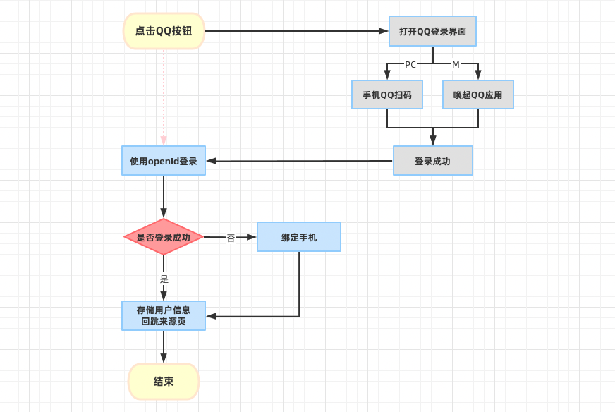
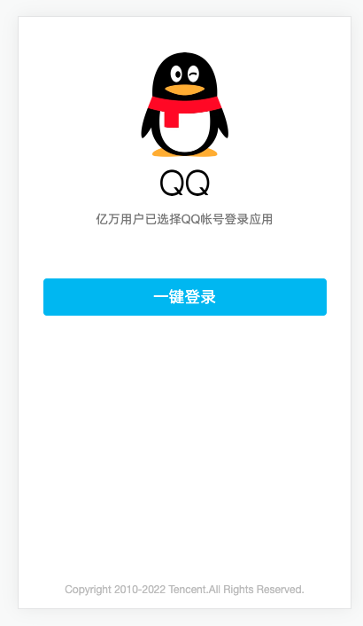
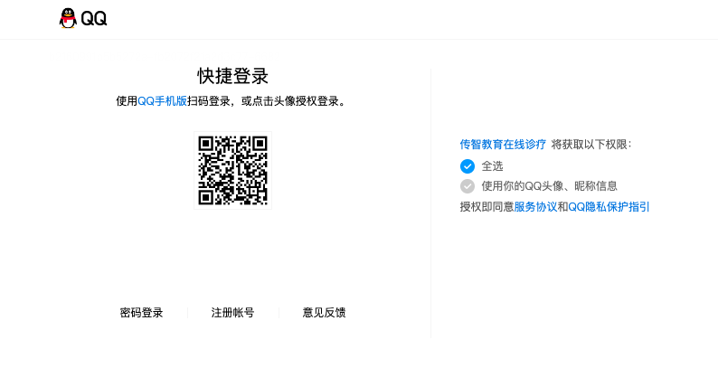
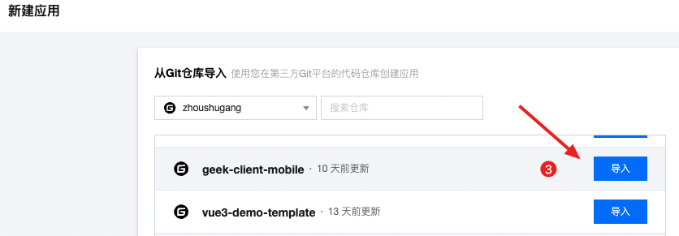
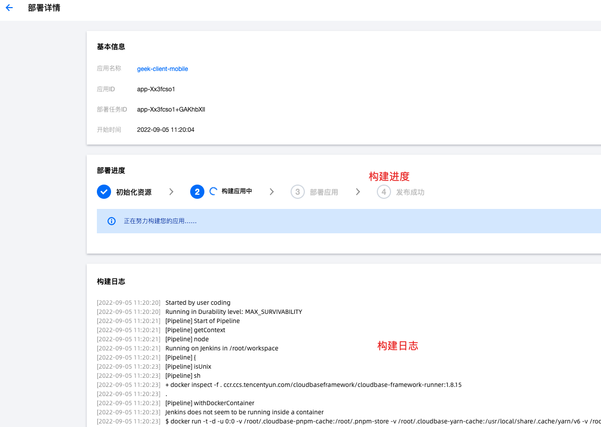
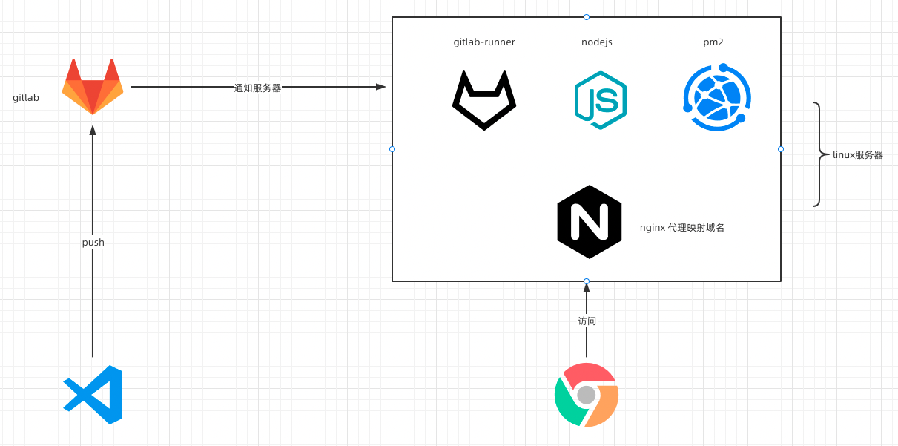

# 其他扩展

## 第三方登录-QQ登录流程




首先：
- 需要在 [QQ互联](https://connect.qq.com/index.html) 平台注册。
- 需要实名身份认证，审核通过。
- 然后创建我的web应用，需要有网站域名，需要域名备案号，设置登录成功回跳地址，审核通过。
- 得到 appid 和 回跳地址。

```bash
# 测试用 appid 
# 102015968
# 测试用 redirect_uri
# http://consult-patients.itheima.net/login/callback
```


步骤：

- 准备QQ登录按钮
- 准备回跳页面
  - 使用 openID 进行登录
  - 登录成功，跳转到来源页面
  - 登录失败，显示绑定手机界面
    - 绑定成功，跳转到来源页面


## 第三方登录-跳转QQ登录

步骤：
- 引入QQ登录SDK
- 生成QQ登录跳转链接
- 登录后回跳成功
- 本地host配置

代码：

1） 引入QQ登录SDK

`index.html`
```vue
<script
  src="https://connect.qq.com/qc_jssdk.js"
  data-appid="102015968"
  data-redirecturi="http://consult-patients.itheima.net/login/callback"
></script>
```

2）生成QQ登录跳转链接，改成直接跳转

```ts
  onMounted(() => {
    // 组件渲染完毕，使用QC生成QQ登录按钮，目的得到跳转链接
    QC.Login({
      btnId: 'qq'
    })
  })
```
```html
<div class="icon" id="qq">
```
以上可以审查元素看到登录链接，复制后改成 A 标签改成 href 跳转即可
```html
  <a
    href="https://graph.qq.com/oauth2.0/authorize?client_id=102015968&response_type=token&scope=all&redirect_uri=http%3A%2F%2Fconsult-patients.itheima.net%2Flogin%2Fcallback"
  >
    
  </a>
```



:::tip 注意

在手机访问会走QQ登录手机页面，点击按钮唤起QQ应用进行登录，课堂无法演示（限制域名）

开发中可以把谷歌手机模拟器关闭，关闭后可以可以使用手机QQ扫码进行登录，可走通流程。

:::



3）登录后回跳成功

链接如下，路由为 `/login/callback`
```
http://consult-patients.itheima.net/login/callback#access_token=B417C0C3EBF93A380A22A188A9C491A4&expires_in=7776000
```

4） 本地host配置
`windows`

```
1. 找到 C:\Windows\System32\drivers\etc 下hosts文件
2. 在文件中加入  127.0.0.1       consult-patients.itheima.net
3. 保存即可。
# 如果提示没有权限
1. 将hosts文件移到桌面，然后进行修改，确认保存。
2. 将桌面hosts文件替换c盘文件
```

`mac OS`

```
1. 打开命令行窗口
2. 输入：sudo vim /etc/hosts
3. 按下：i 键
4. 输入：127.0.0.1       consult-patients.itheima.net
5. 按下：esc
6. 按下：shift + :
7. 输入：wq 回车即可
# 如果未生效，可执行 sudo killall mDNSResponder
```

5） vite 配置
```ts
  server: {
    port: 80,
    host: true
  },
```

6）回跳地址白名单
```diff
router.beforeEach((to) => {
  NProgress.start()
  const store = useUserStore()
+  const whiteList = ['/login', '/login/callback']
  if (!store.user?.token && !whiteList.includes(to.path)) return '/login'
})
```
```ts
    {
      path: '/login/callback',
      component: () => import('@/views/Login/LoginCallback.vue'),
      meta: { title: 'QQ登录-绑定手机' }
    }
```
```vue
<script setup lang="ts"></script>

<template>
  <div class="login-callback-page">login-callback</div>
</template>

<style lang="scss" scoped></style>
```


## 第三方登录-进行登录

步骤：
- 编写QQ登录API函数
- 提供 `QC` 相关的类型，使用QQ的SDK提供 `QC` 相关API获取 `openId`
- 提交三方登录亲请求
  - 1 如果之前没绑定，失败：需要绑定手机
  - 2 如果之前绑定过，成功：和之前登录成功一样的逻辑
  - 刚注册用户，属于情况1

代码：

1）编写QQ登录API函数
```ts
export const loginByQQ = (openId: string) =>
  request<User>('/login/thirdparty', 'POST', { openId, source: 'qq' })
```

2）提供 `QC` 相关的类型，使用QQ的SDK提供 `QC` 相关API获取 `openId`
`global.d.ts`
```ts
type QCType = {
  Login: {
    check(): boolean
    getMe(cb: (openId: string) => void): void
  }
}

declare const QC: QCType
```

3）进行QQ登录
`/Login/LoginCallback.vue`  记录 openId 和 isBind
```vue
<script setup lang="ts">
/*global QC*/
import { onMounted, ref } from 'vue'

const openId = ref('')
const isNeedBind = ref(false)
onMounted(() => {
  if (QC.Login.check()) {
    QC.Login.getMe((id) => {
      openId.value = id
      // QQ，登录
      loginByQQ(id)
        .then((res) => {
          // 登录成功
        })
        .catch(() => {
          // 登录失败
          isNeedBind.value = true
        })
    })
  }
})
</script>

<template>
  <div class="login-callback-page">login-callback</div>
</template>

<style lang="scss" scoped></style>
```

```vue
<template>
  <div class="login-page" v-if="isNeedBind">
    <cp-nav-bar></cp-nav-bar>
    <div class="login-head">
      <h3>手机绑定</h3>
    </div>
    <van-form autocomplete="off" ref="form">
      <van-field name="mobile" placeholder="请输入手机号"></van-field>
      <van-field name="code" placeholder="请输入验证码">
        <template #button>
          <span class="btn-send">发送验证码</span>
        </template>
      </van-field>
      <div class="cp-cell">
        <van-button
          style="margin-top: 50px"
          block
          round
          type="primary"
          native-type="submit"
        >
          立即绑定
        </van-button>
      </div>
    </van-form>
  </div>
</template>

<style lang="scss" scoped>
@import '@/styles/login.scss';
</style>
```

小结：
- `isNeedBind` 是 `true` 需要显示绑定手机界面

## 第三方登录-验证码composable

1）分析 composable 需要传入参数，返回哪些数据
```
参数：
1. 手机号
2. 发短信类型

返回：
1. form 表单实例
2. time 倒计时数据
3. send 发送函数
```

2）提取函数
```ts
import { showToast, type FormInstance } from 'vant'
import { sendMobileCode } from '@/services/user'
import type { CodeType } from '@/types/user'
```
```ts
// 发送短信验证码吗逻辑
export const useSendMobileCode = (mobile: Ref<string>, type: CodeType = 'login') => {
  const form = ref<FormInstance>()
  const time = ref(0)
  let timeId: number
  const onSend = async () => {
    if (time.value > 0) return
    await form.value?.validate('mobile')
    await sendMobileCode(mobile.value, type)
    showToast('发送成功')
    time.value = 60
    // 倒计时
    clearInterval(timeId)
    timeId = setInterval(() => {
      time.value--
      if (time.value <= 0) clearInterval(timeId)
    }, 1000)
  }
  onUnmounted(() => {
    clearInterval(timeId)
  })
  return { form, time, onSend }
}
```

3）使用函数
```ts
const { form, time, onSend } = useSendMobileCode(mobile, 'login')
```

## 第三方登录-绑定手机

步骤：
- 表单校验
- 发送验证码使用composable
- 进行绑定
- 绑定成功即是登录成功，根据是否有回跳地址进行跳转

代码：

1）表单校验
```ts 
import { mobileRules, codeRules } from '@/utils/rules'


const mobile = ref('')
const code = ref('')
const bind = async () => {
  // 校验通过
}
```

```html 
<van-form autocomplete="off" @submit="bind" ref="form">
  <van-field
    v-model="mobile"
    name="mobile"
    :rules="mobileRules"
    placeholder="请输入手机号"
  ></van-field>
  <van-field v-model="code" name="code" :rules="codeRules" placeholder="请输入验证码">
    <template #button>
      <span class="btn-send">发送验证码</span>
    </template>
  </van-field>
  <div class="cp-cell">
    <van-button style="margin-top: 50px" block round type="primary" native-type="submit"> 立即绑定 </van-button>
  </div>
</van-form>
```

2）发送验证码
```ts
const { form, time, onSend } = useSendMobileCode(mobile, 'bindMobile')
```
```html 
  <template #button>
    <span class="btn-send" :class="{ active: time > 0 }" @click="onSend">
      {{ time > 0 ? `${time}s后再次发送` : '发送验证码' }}
    </span>
  </template>
```

3）进行绑定

```ts
export const bindMobile = (data: { mobile: string; code: string; openId: string }) =>
  request<User>('/login/binding', 'POST', data)
```

```ts
import type { User } from '@/types/user'


// 登录成功
const store = useUserStore()
const router = useRouter()
const loginSuccess = (res: { data: User }) => {
  store.setUser(res.data)
  router.replace('/user')
  showSuccessToast('登录成功')
}

const bind = async () => {
  const res = await bindMobile({
    mobile: mobile.value,
    code: code.value,
    openId: openId.value
  })
  loginSuccess(res)
}
```
```diff
      loginByQQ(id)
        .then((res) => {
+          loginSuccess(res)
        })
        .catch(() => {
          isBind.value = false
        })
```

4) 绑定成功即是登录成功，根据是否有回跳地址进行跳转

`stores/modules/user.ts`
```ts
   // 记录回跳地址
    const returnUrl = ref('')
    const setReturnUrl = (url: string) => (returnUrl.value = url)
    return { user, setUser, delUser, returnUrl, setReturnUrl }
```
`Login/index.vue`
```diff
        <a
+          @click="store.setReturnUrl($route.query.returnUrl as string)"
          href="https://graph.qq.com/oauth2.0/authorize?client_id=102015968&response_type=token&scope=all&redirect_uri=http%3A%2F%2Fconsult-patients.itheima.net%2Flogin%2Fcallback"
        >
          
        </a>
```
`Login/LoginCallback.vue`
```diff
// 登录成功
const loginSuccess = (res: { data: User }) => {
  store.setUser(res.data)
  // 如果有回跳地址就进行回跳，没有跳转到个人中心
+  router.replace(store.returnUrl || '/user')
  Toast.success('登录成功')
+  store.setReturnUrl('')
}
```


## 扩展-开发生产环境


步骤：

- 知道使用 什么是开发环境和生成环境？
  - run dev 是本地开发环境，run build 是线上生产环境
- QQ回调地址：
  - 线上：https://cp.itheima.net/login/callback
  - 本地：http://consult-patients.itheima.net/login/callback
- 支付回调
  - 问诊支付
    - 线上：https://cp.itheima.net/room
    - 本地：http://consult-patients.itheima.net/room
  - 药品支付
    - 线上：https://cp.itheima.net/order/pay/result
    - 本地：http://consult-patients.itheima.net/order/pay/result
- 标题：生产环境（优医问诊），本地环境（本地-优医问诊）

代码：

`.env.development`
```
VITE_APP_CALLBACK=http://consult-patients.itheima.net
VITE_APP_TITLE=本地-优医问诊
```
`.env.production`
```
VITE_APP_CALLBACK=https://cp.itheima.net
VITE_APP_TITLE=优医问诊
```

**JS文件中**

1) 跳转QQ登录 `Login/index.vue`
```ts
const qqUrl = `https://graph.qq.com/oauth2.0/authorize?client_id=102015968&response_type=token&scope=all&redirect_uri=${encodeURIComponent(
  import.meta.env.VITE_APP_CALLBACK + '/login/callback'
)}`
```
```html 
  <a @click="store.setReturnUrl($route.query.returnUrl as string)" :href="qqUrl">
    
  </a>
```

2）CpPaySheet 加入动态域名

```diff
  const res = await getConsultOrderPayUrl({
    orderId: orderId,
    paymentMethod: paymentMethod.value,
+    payCallback: import.meta.env.VITE_APP_CALLBACK + payCallback
  })
```

3）配置问诊支付回调
`Consult/ConsultPay.vue` `User/ConsultDetail.vue`
```diff
      <cp-pay-sheet
        v-model:show="show"
        :order-id="orderId"
        :actualPayment="payInfo.actualPayment"
        :onClose="onClose"
+        pay-callback="/room"
      />
```

4）配置药品订单支付回调
`Order/OrderPay.vue`
```diff
    <cp-pay-sheet
      :orderId="orderId"
      :actualPayment="orderPre.actualPayment"
      v-model:show="show"
+      payCallback="/order/pay/result"
    />
```

**index.html中**

安装 html 模板插件
```bash
pnpm add vite-plugin-html -D
```

`vite.config.ts`
```ts
import { createHtmlPlugin } from 'vite-plugin-html'
```
```ts
plugins: [
  createHtmlPlugin()
]
```
`index.html`  `<%=环境变量名%>` 取出值
```html
  <head>
    <meta charset="UTF-8" />
    <link rel="icon" href="/favicon.ico" />
    <meta name="viewport" content="width=device-width, initial-scale=1.0" />
    <title><%=VITE_APP_TITLE%></title>
  </head>
  <body>
    <div id="app"></div>
    <script type="module" src="/src/main.ts"></script>
    <script
      src="https://connect.qq.com/qc_jssdk.js"
      data-appid="102015968"
      data-redirecturi="<%=VITE_APP_CALLBACK%>/login/callback"
    ></script>
```


## 扩展-真机调试

- 在 Chrome 浏览器中使用什么进行调试？
  - 控制面板，开发者工具，F12
- 在 手机端 浏览器使用什么进行调试呢？
- Eruda 手机调试面板工具

使用方式：https://github.com/liriliri/eruda

`index.html`

```html
    <script src="https://cdnjs.cloudflare.com/ajax/libs/eruda/2.4.1/eruda.min.js"></script>
    <script>eruda.init()</script>
```

只在开发环境使用：
```html
    <% if(DEV){ %>
    <script src="https://cdnjs.cloudflare.com/ajax/libs/eruda/2.4.1/eruda.min.js"></script>
    <script>eruda.init()</script>
    <% } %>
```

小结：
- 使用 vite-plugin-html 解析模板，默认支持 ejs 模板引擎语法


## 扩展-mock接口数据

https://www.npmjs.com/package/vite-plugin-mock

1）安装 vite-plugin-mock mockjs
```bash
pnpm i vite-plugin-mock mockjs -D
```

2）使用插件扫描 `src/mock` 下文件
```ts
import { viteMockServe } from 'vite-plugin-mock'
```
```ts
plugins: [
    viteMockServe({
      mockPath: './src/mock',
      localEnabled: true
    })
]
```

3）mock文件 `src/mock/index.ts`
```ts
import type { MockMethod } from 'vite-plugin-mock'
import Mock from 'mockjs'

const rules: MockMethod[] = [
  {
    url: '/patient/message/list',
    method: 'get',
    timeout: 1000,
    response: () => {
      const data = []
      for (let i = 0; i < 10; i++) {
        data.push(
          Mock.mock({
            id: '@id',
            avatar: '@image("100x100")',
            title: '@ctitle(3,10)',
            lastContent: '@ctitle(10,40)',
            sendTime: '@datetime()'
          })
        )
      }
      return {
        code: 10000,
        message: '获取数据成功',
        data
      }
    }
  }
]

export default rules
```


使用注意：
- 这些mock接口是  vite 本地服务器提供的，请求的时候不能带上其他服务器的域名。

## 项目部署-pm2部署

1）本地打包

```sh
pnpm build
```

得到 dist 资源包


2）上传服务器

服务器一般是 linux系统，使用 XFTP 进行文件的上传和下载（这个就不赘述了）


3）服务器使用pm2进行部署（本地演示） [托管静态资源](https://pm2.keymetrics.io/docs/usage/expose/)

全局安装：

```sh
npm i pm2 -g
```

进入dist：

```sh
# pm2 serve 目录 端口  --name 服务名称
pm2 serve ./ 8080 --name my-cp-server
```


4）history路由模式问题，如果有子路径，刷新页面 404 

原因：hostory 改变路由是前端切换，不会请求服务器，一旦刷新浏览器 `/consult/dep`按照这个地址请求服务器，是没有对应的资源的。

解决：遇见子路径且没有后缀名，服务器定位到 ‘index.html’ 页面返回给前端即可。

命令：

```sh
pm2 serve --spa ./ 8080 --name my-cp-server
```


pm2其他命令：

```sh
# 查看服务列表
pm2 list
# 删除服务
pm2 delete my-cp-server
```


## 自动部署-腾讯云部署


[腾讯云-Web应用托管](https://console.cloud.tencent.com/webify/index)

- 注册，实名认证，才可以使用 webify 服务

使用步骤演示：

1）创建应用


2）关联码云，需要码云授权


3）选择需要使用的仓库



4）构建配置


5）进行构建




6）尝试访问


自动部署流程：


## 自动部署-gitlab部署(演示)




1. 本地Vscode编写代码
2. gitlab是企业版，内部部署
3. Linux服务器
   1. 安装 gitlab-runner 用于拉取仓库代码
   2. 安装 Nodejs 用于打包项目
   3. 安装 pm2 用于启动静态资源托管，守护进程
4. 运维使用 Nginx 进行域名代理
5. 用户通过浏览器访问服务

依赖于gitlab-ci.yml配置文件

```text
stages:
  - build
cache:
  key: ${CI_BUILD_REF_NAME}
  paths:
    - node_modules/

build-140:
  stage: build
  only:
    - master
  script:
    - rm -rf node_modules/
    - pnpm i
    - pnpm build
    - rm -rf /home/patient-h5-preview
    - mkdir /home/patient-h5-preview
    - cp -r dist/* /home/patient-h5-preview
    - cd /home/patient-h5-preview
    - pm2 delete patient-h5-preview || echo no
    - pm2 serve --spa ./ 8083 --name patient-h5-preview
  tags: 
    - patient-h5-preview
```

