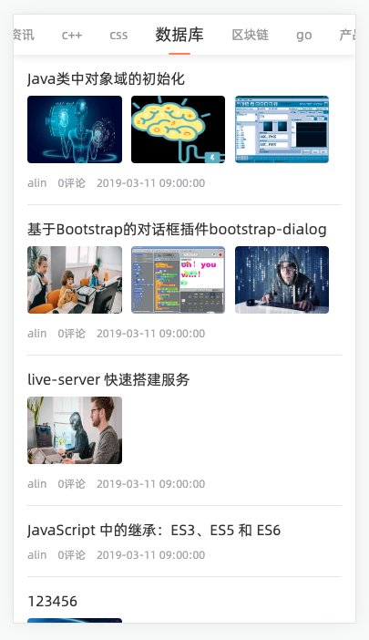

# TS 黑马头条案例



## 基础结构{#case-html}

> 完成：项目的基础结构搭建

基础样式：`styles/index.css`

```css
* {
  margin: 0;
  box-sizing: border-box;
}
#app {
  height: 100vh;
  overflow: hidden;
  display: flex;
  flex-direction: column;
}
.channel-nav {
  height: 44px;
  overflow-x: auto;
  box-shadow: 0 2px 10px rgba(0, 0, 0, 0.1);
}
.channel-nav::-webkit-scrollbar {
  display: none;
}
.channel-nav .list {
  display: flex;
}
.channel-nav .item {
  padding: 0 15px;
  height: 44px;
  text-align: center;
  line-height: 44px;
  text-decoration: none;
  font-size: 14px;
  color: #999;
  white-space: nowrap;
  -webkit-tap-highlight-color: transparent;
  position: relative;
  transition: all 0.3s;
}
.channel-nav .item::after {
  content: '';
  position: absolute;
  left: 50%;
  bottom: 0;
  width: 0px;
  height: 2px;
  border-radius: 1px;
  background-color: coral;
  transform: translateX(-50%);
  transition: all 0.3s;
}
.channel-nav .item.active::after {
  width: 24px;
}
.channel-nav .item.active {
  color: #333;
  font-size: 18px;
}
.article-list {
  flex: 1;
  overflow-y: auto;
  padding: 0 15px;
}
.article-item {
  padding: 15px 0;
  border-bottom: 0.5px solid rgba(0,0,0,.07);
}
.article-item .title {
  width: 100%;
  margin: 0;
  line-height: 22px;
  font-size: 16px;
  color: #333;
  margin-bottom: 8px;
  max-height: 44px;
  display: -webkit-box;
  overflow: hidden;
  text-overflow: ellipsis;
  -webkit-box-orient: vertical;
  -webkit-line-clamp: 2;
}
.article-item .img {
  width: 30%;
  height: 74px;
  border-radius: 4px;
  margin-bottom: 8px;
  margin-right: 3%;
}
.article-item .info {
  width: 100%;
  color: #a5a6ab;
  font-size: 12px;
  position: relative;
}
.article-item .info span {
  margin-right: 12px;
}
```

使用样式 `main.ts`

```ts{2}
import { createApp } from 'vue';
import './styles/index.css'
import App from './App.vue';

createApp(App).mount('#app');
```

准备组件：

`components/ChannelNav.vue`

```vue
<script setup lang="ts"></script>

<template>
  <div class="channel-nav">
    <nav class="list">
      <a
        class="item"
        :class="{ active: i === 0 }"
        href="javascript:;"
        v-for="(item, i) in 10"
        :key="i"
      >
        推荐{{ item }}
      </a>
    </nav>
  </div>
</template>
```
`components/ArticleList.vue`

```vue
<script setup lang="ts"></script>

<template>
  <div class="article-list">
    <div class="article-item" v-for="i in 10" :key="i">
      <p class="title">美国强行关闭33家伊朗网站 伊总统办公室警告：不利于伊核谈判</p>
      
      
      
      <div class="info">
        <span>小兵张嘎</span>
        <span>17评论</span>
        <span>1天前</span>
      </div>
    </div>
  </div>
</template>
```

使用组件：`App.vue`
```vue
<script setup lang="ts">
import ChannelNav from './components/ChannelNav.vue';
import ArticleList from './components/ArticleList.vue'
</script>

<template>
  <ChannelNav></ChannelNav>
  <ArticleList></ArticleList>
</template>
```

## axios 与 TypeScript{#axios-and-ts}
>掌握：掌握axios配合泛型，设置响应数据类型

```vue
<script setup lang="ts">
import axios from 'axios';
// 使用TS的时候，axios()调用需要改为 axios.request()，可以使用泛型
// 1. 使用泛型的目的的告诉axios返回数据的类型如何
// 2. 泛型的类型需要和接口返回的一致，否则无意义
// 频道对象
type ChannelItem = {
  id: number;
  name: string;
};

// 频道接口响应数据
type ChannelResData = {
  data: {
    channels: ChannelItem[];
  };
  message: string;
};
axios
  .request<ChannelResData>({
    url: 'http://geek.itheima.net/v1_0/channels',
  })
  .then((res) => {
    // res.data 的类型就是 Data
    console.log(res.data.data.channels[0].name);
  });
</script>
```

小结：
- 使用axios的时候怎么给返回数据提供类型？
  - `axios.request<数据类型>()`  其他请求方法类似
- 提供的类型要注意啥？
  - 类型需要根据接口返回的数据类声明，或者根据接口文档

## 频道渲染{#case-channel}
> 完成：axios获取数据后频道列表渲染

步骤：
- 提取类型到 `types` 目录
- 在组件初始化通过 `axios.get` 获取数据
- 进行渲染

`types/data.d.ts`
```ts
// 频道对象
export type ChannelItem = {
  id: number;
  name: string;
};

// 频道接口响应数据
export type ChannelResData = {
  data: {
    channels: ChannelItem[];
  };
  message: string;
};
```

`ChannelNav.vue`
```vue
<script setup lang="ts">
import axios from 'axios';
import { onMounted, ref } from 'vue';
import { ChannelItem, ChannelResData } from '../types/data'
// 创建响应式数据
const channels = ref<ChannelItem[]>([])
onMounted(async ()=>{
  const res = await axios.get<ChannelResData>('http://geek.itheima.net/v1_0/channels')
  // 给响应式数据赋值
  channels.value = res.data.data.channels
})
</script>

<template>
  <div class="channel-nav">
    <nav class="list">
      <a
        class="item"
        href="javascript:;"
        v-for="(item, i) in channels"
        :key="item.id"
      >
        {{item.name}}
      </a>
    </nav>
  </div>
</template>
```

## 导航切换{#case-nav-toogel}

> 完成：频道导航切换效果

- 切换的频道ID将来需要给 `ArticleList` 组件使用，所以在 `App` 组件定义数据
- 在 `ChannelNav` 改变频道的时候，通过自定义事件传递给 `App` 组件使用和修改


默认选中

`App.vue`
```vue{4,7,11}
<script setup lang="ts">
import ChannelNav from './components/ChannelNav.vue';
import ArticleList from './components/ArticleList.vue'
import { ref } from 'vue';

// 数据App维护，因为切换频道ID的时候 列表需要根据频道ID更新
const channelId = ref(0)
</script>

<template>
  <ChannelNav :channelId="channelId" />
  <ArticleList />
</template>
```
`ChannelNav.vue`
```diff

// 2.完成切换效果
+defineProps<{ channelId: number }>()
</script>

<template>
  <div class="channel-nav">
    <nav class="list">
      <a
        class="item"
+        :class="{active: channelId === item.id}"
        href="javascript:;"
        v-for="item in channels"
```

进行切换

`ChannelNav.vue`
```diff
+const emit = defineEmits<{
+  (e: 'changeChannel', id: number): void;
+}>();
</script>

<template>
  <div class="channel-nav">
    <nav class="list">
      <a
        class="item"
        :class="{ active: channelId === item.id }"
        href="javascript:;"
        v-for="item in channels"
        :key="item.id"
+        @click="emit('changeChannel', item.id)"
      >
        {{ item.name }}
      </a>
    </nav>
  </div>
</template>
```
`App.vue`
```xml
<ChannelNav :channelId="channelId" @change-channel="channelId = $event"/>
```

## 列表更新{#case-list}

> 实现：频道切换后列表更新

步骤：
- 声明接口数据的类型
- 监听频道ID变化，开启默认执行
- 发起请求，获取数据
- 完成渲染

代码：

- 类型
`types/data.d.ts`
```ts
// 文章对象
export type ArticleItem = {
  art_id: string;
  aut_id: string;
  aut_name: string;
  comm_count: number;
  cover: {
    cover: number;
    images: string[];
  };
  is_top: number;
  pubdate: string;
  title: string;
};

// 文章接口响应数据
export type ArticleResData = {
  data: {
    pre_timestamp: string;
    results: ArticleItem[];
  };
  message: string;
};
```

- 监听频道ID变化，开启默认执行，获取数据

`App.vue`
```xml
<ArticleList :channelId="channelId"/>
```
`ArticleList.vue`
```ts
import axios from 'axios';
import { ref, watch } from 'vue';
import { ArticleItem, ArticleResData } from '../types/data';

const props = defineProps<{ channelId: number }>();

const articles = ref<ArticleItem[]>([]);
watch(
  () => props.channelId,
  async () => {
    const res = await axios.get<ArticleResData>(
      `http://geek.itheima.net/v1_0/articles`,
      {
        params: {
          channel_id: props.channelId,
          timestamp: Date.now(),
        },
      },
    );
    articles.value = res.data.data.results;
  },
  { immediate: true }
);
```

- 渲染

```vue
<template>
  <div class="article-list">
    <div class="article-item" v-for="item in articles" :key="item.art_id">
      <p class="title">{{ item.title }}</p>
      
      <div class="info">
        <span>{{ item.aut_name }}</span>
        <span>{{ item.comm_count }}评论</span>
        <span>{{ item.pubdate }}</span>
      </div>
    </div>
  </div>
</template>
```


