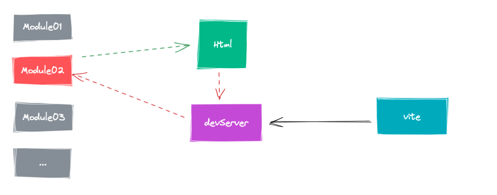

# 快速开始

## vue3 现状介绍

> 了解：vue3 的现状以及它特点


1. Vue3 的现状

2020 年 9 月 18 日发布，许多开发者还在观望。2022 年 2 月 7 日称为默认版本，意味着 vue3 是现在也是未来。

| 库名称  | 简介 |
| :----| :----|
| [ant-design-vue](https://antdv.com/docs/vue/introduce-cn/) | ant-design-vue 是 Ant Design 的 Vue 实现，组件的风格与 Ant Design 保持同步    |
| [element-plus](https://antdv.com/docs/vue/introduce-cn/)   | Element Plus，一套为开发者、设计师和产品经理准备的基于 Vue 3.0 的桌面端组件库 |
| [vant](https://vant-contrib.gitee.io/vant/v3/#/zh-CN)      | 有赞前端团队开源的移动端组件库，于 2016 年开源，已持续维护 4 年时间           |
| [Naive UI](https://vant-contrib.gitee.io/vant/v3/#/zh-CN)  | 一个 Vue 3 组件库比较完整，主题可调，使用 TypeScript，不算太慢，有点意思      |
| [VueUse](https://vueuse.org/)                              | 基于 composition 组合 api 的常用函数集合                                      |

2. 相关文档

   1. Vue3 中文文档 https://vue3js.cn/docs/zh/
   2. Vue3 设计理念 https://vue3js.cn/vue-composition/

3. 了解框架优点特点
   1. 首次渲染更快
   2. diff 算法更快
   3. 内存占用更少
   4. 打包体积更小
   5. 更好的 Typescript 支持
   6. `Composition API` 组合 API

**总结：**

- 学习 vue3 加薪不是事，学习 vue3 主要学习 `组合API` 的使用。


## vite 构建工具

> 了解：vite工具作用和特点

vite（法语意为 "快速的"，发音 `/vit/`，发音同 "veet") 是一种新型前端构建工具，能够显著提升前端开发体验。

对比webpack：
- 需要查找依赖，打包所有的模块，然后才能提供服务，更新速度会随着代码体积增加越来越慢


vite的原理：
- 使用原生ESModule通过script标签动态导入，访问页面的时候加载到对应模块编译并响应




注明：项目打包的时候最终还是需要打包成静态资源的，打包工具 Rollup


问题：
- 基于 `webpack` 构建项目，基于 `vite` 构建项目，谁更快体验更好？vite
- 基于 `webpack` 的 `vue-cli` 可以创建vue项目吗？可以，慢一点而已


## vite 创建项目

> 掌握：使用vite构建工具创建项目


1. 运行创建项目命令：

```bash
# 使用npm
npm create vite@latest
# 使用yarn
yarn create vite
# 使用pnpm
pnpm create vite
```

2. 输入项目名称，默认是 vite-project


3. 选择前端框架


4. 选择项目类型


5. 创建完毕


6. 进入项目目录，安装依赖，启动项目即可。


## 代码解析
> 对vite初始化的代码进行分析

1. 需要切换插件

vue3组件代码和vue2有些不一样，使用的语法提示和高亮插件也不一样。

- `vuter` 插件需要禁用，安装 `volar`插件。


2. 总结vue3写法不同

   
   1. 组件一个根节点非必需
   
   
   1. 创建应用挂载到根容器
   2. 入口页面，ESM加载资源

`平常组件`

```vue
<template>
  <div>节点1</div>
  <div>节点2</div>
</template>
```

`main.js`
```js
import { createApp } from 'vue'
import App from './App.vue'
// 根据App组件创建一个应用实例
const app = createApp(App)
// app应用挂载（管理）index.html的 #app 容器
app.mount('#app')
```

`index.html`
```html
<div id="app"></div>
<script type="module" src="/src/main.js"></script>
```


总结：

- 安装 `volar` 禁用 `vuter`
- vue中是使用 `createApp()` 管理容器，不是 `new Vue()` 
