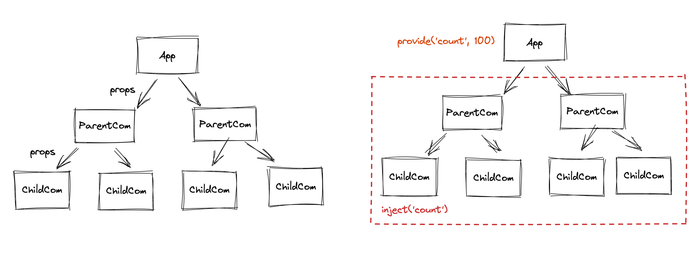
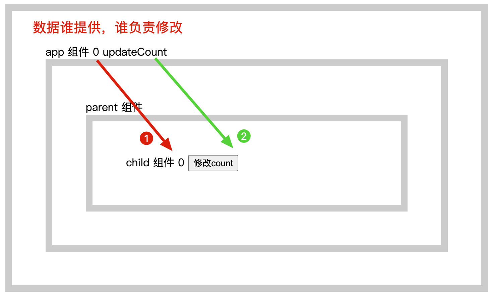

# CompositionAPI

## 组合API介绍

```js
cons a = 10;
cons a = 10;
cons a = 10;
cons a = 10;
cons a = 10;
cons a = 10;
cons a = 10;
```


## setup函数


## reactive函数


## ref函数


## setup语法糖


## computed函数


## watch函数


## 生命周期函数


## ref获取DOM元素


## ref获取组件实例-defineExpose


## 父传子-defineProps函数


## 子传父-defineEmits函数


## 跨级组件通讯provide与inject函数




通过provide和inject函数可以**简便的**实现跨级组件通讯


接下来我们通过一个小案例，运用一下provide和inject函数




落地代码：

- 祖先组件：`App.vue`

```vue
<template>
  <div
    class="app-page"
    style="border: 10px solid #ccc; padding: 50px; width: 600px"
  >
    app 组件 {{ count }} updateCount
    <ParentCom />
  </div>
</template>

<script setup>
import { provide, ref } from 'vue';
import ParentCom from './ParentCom.vue';

// 1. app组件数据传递给child
const count = ref(0);
provide('count', count);

// 2. app组件函数传递给child，调用的时候可以回传数据
const updateCount = (num) => {
  count.value += num;
};
provide('updateCount', updateCount);
</script>
```

- 父级组件：`ParentCom.vue`

```vue
<template>
  <div class="parent-page" style="padding: 50px">
    parent 组件
    <hr />
    <ChildCom />
  </div>
</template>

<script setup>
import ChildCom from './ChildCom.vue';
</script>
```

- 子级组件：`ChildCom.vue`

```vue
<template>
  <div class="child-page" style="padding: 50px; border: 10px solid #ccc">
    child 组件 {{ count }} <button @click="updateCount(100)">修改count</button>
  </div>
</template>

<script>
const count = inject('count');
const updateCount = inject('updateCount');
</script>
```


总结：

- provide和inject是解决跨级组件通讯的方案
  - provide 提供后代组件需要依赖的数据或函数
  - inject 注入（获取）provide提供的数据或函数

- 官方术语：依赖注入
  - App是后代组件依赖的数据和函数的提供者，Child是注入（获取）了App提供的依赖，所以叫**依赖注入**。


## 保持响应式-toRefs函数